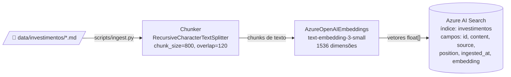
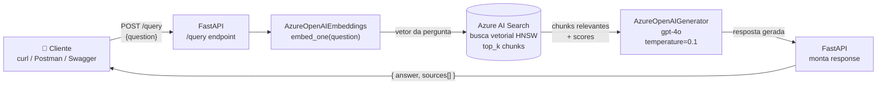

# Arquitetura

## Visão geral

Aplicação RAG (Retrieval-Augmented Generation) end-to-end sobre documentos de
investimentos brasileiros, com deploy em Azure.

### Fluxo de Ingestão

### Fluxo de Consulta (Query)

## Componentes

### 1. Ingestão (`scripts/ingest.py` + `app/rag/chunker.py`)
- Lê arquivos `.md` em `data/investimentos/`.
- Aplica `RecursiveCharacterTextSplitter` (separadores: parágrafo → linha →
  frase → palavra) preservando fronteiras semânticas.
- Parâmetros: `chunk_size=800`, `chunk_overlap=120`. Escolha justificada para
  textos didáticos em português, onde 800 caracteres ≈ 4–6 frases (uma ideia
  completa) e 15% de overlap evita perda de contexto entre cortes.

### 2. Embeddings (`app/rag/embeddings.py`)
- `AzureOpenAIEmbeddings` via `openai` SDK apontando para Azure.
- Modelo: `text-embedding-3-small` (1536 dimensões).
- Retentativas exponenciais (`tenacity`) em até 3 tentativas para erros
  transitórios.

### 3. Vector store (`app/rag/retriever.py`)
- **Azure AI Search Free tier** (50 MB, 3 índices).
- Índice `investimentos` com 5 campos:
  | Campo     | Tipo                  | Notas                        |
  |-----------|-----------------------|------------------------------|
  | id        | String (key)          | UUID gerado na ingestão      |
  | content   | String (searchable)   | Texto do chunk               |
  | source    | String (filterable)   | Nome do arquivo de origem    |
  | position  | Int32 (filterable)    | Posição do chunk no doc      |
  | embedding | Collection<Single>    | Vetor de 1536 floats         |
- Algoritmo: HNSW com perfil `vector-profile`.

### 4. Generator (`app/rag/generator.py`)
- Mesma abstração de provider que embeddings.
- Modelo padrão: `gpt-4o`.
- Prompt do sistema obriga o modelo a:
  - Responder apenas com base no contexto.
  - Citar trechos com `[#índice]`.
  - Admitir quando não há informação suficiente.
- `temperature=0.1` para respostas estáveis.

### 5. API (`app/main.py` + `app/api/`)
- FastAPI com OpenAPI automático em `/docs`.
- Endpoints:
  - `GET /health` — liveness com info de provider e índice.
  - `POST /ingest` — recebe `{text, source}`, retorna `{indexed, source}`.
  - `POST /query` — recebe `{question, top_k?}`, retorna `{answer, citations}`.

## Fluxo de uma query

1. Cliente envia `POST /query {"question": "..."}`.
2. API gera embedding da pergunta via Azure OpenAI.
3. Busca vetorial no AI Search retorna `top_k` chunks mais similares.
4. Generator monta prompt com contexto e chama o LLM.
5. Resposta retorna com citações `[{source, position, score, excerpt}]`.
